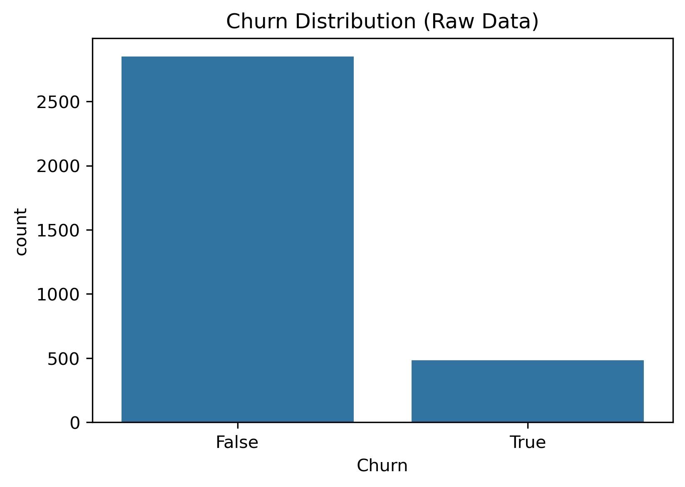
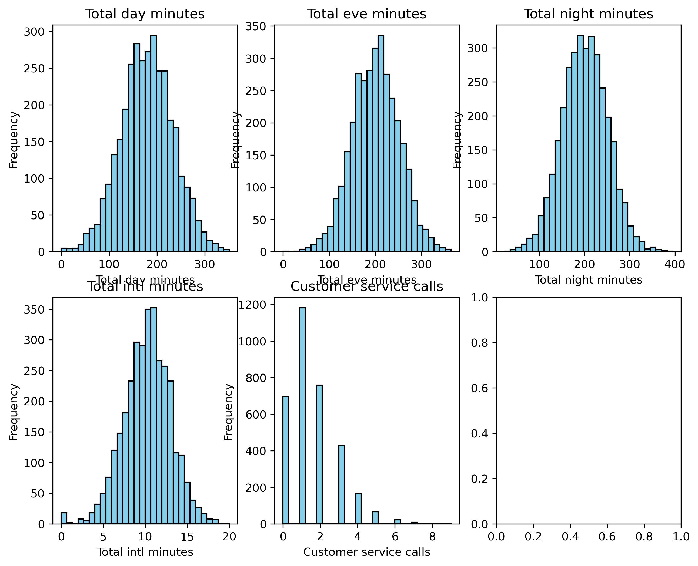
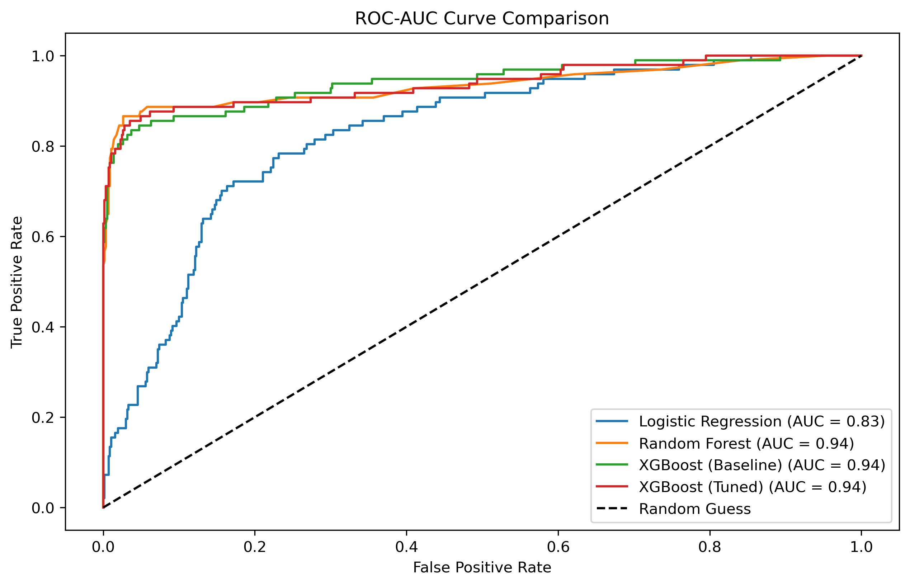

# Customer-Churn-Prediction with Machine Learning

## Project for Codveda Internship

**-** Predicting customer churn using classification models (Logistic Regression, Random Forest, XGBoost).

### 📌 Project Overview

This project focuses on predicting customer churn — whether a customer will stop using a service — based on their account and usage data. The dataset contains information such as:

- Account length
- International/Voice mail plan status
- Usage statistics (day/eve/night/international minutes & calls)
- Number of customer service calls

The goal is to build a robust predictive model that can help businesses identify at-risk customers and take proactive retention measures.

📂 Dataset:

The dataset is split into two files: churn-bigml-20.csv and churn-bigml-80.csv. For this analysis, both files were combined to form a complete dataset of 3,333 rows.

### 📈 Key Insights from Exploratory Data Analysis (EDA)

1. Churn Distribution (Imbalanced Dataset)

- The dataset is imbalanced: ~85% of customers did not churn (Churn = 0), while only ~15% churned (Churn = 1).
- This imbalance must be handled carefully during modeling (e.g., using class_weight='balanced' or focusing on metrics like Precision, Recall, and F1-score, not just Accuracy).

2. Feature Distributions

- Usage Minutes: Total day, Total eve, and Total night minutes all show normal distributions, centered around 175–200 minutes.
- International Usage: Total intl minutes is highly skewed — most customers use very few or zero international minutes.
- Customer Service Calls: A critical feature! Most customers make 0 or 1 call, but those making 4+ calls are rare and potentially high-risk.

### 🧠 Model Performance Comparison
Four models were trained and evaluated:
- Logistic Regression
- Random Forest
- XGBoost (Baseline)
- XGBoost (Tuned)

ROC-AUC Curve Comparison

- Random Forest, XGBoost (Baseline), and XGBoost (Tuned) all achieved an AUC of 0.94, significantly outperforming Logistic Regression (AUC = 0.83).
- An AUC of 0.94 indicates excellent discriminatory power — the model is very good at distinguishing between churners and non-churners.

🏆 Top 10 Features (Tuned XGBoost)

The tuned XGBoost model identified the following features as most important for predicting churn:
1. Customer service calls — By far the most important feature. Customers who call customer service frequently are at the highest risk of churning.
2. International plan — Having an international calling plan is a strong indicator of potential churn.
3. Total day minutes — High daytime usage correlates with churn.
4. Total intl calls — Frequent international calls are a signal of churn.
5. Voice mail plan — Subscribers with voice mail plans tend to be more loyal (lower churn rate).

💡 Business Insight: Focus retention efforts on customers with high Customer service calls and International plan.

### 📊 Classification Report (Tuned XGBoost)

              precision    recall  f1-score   support

           0       0.96      0.99      0.97       570
           1       0.95      0.73      0.83        97

    accuracy                           0.96       667
   macro avg       0.95      0.86      0.90       667
weighted avg       0.95      0.96      0.95       667

- Accuracy: 96% — overall, the model is correct 96% of the time.
- Recall for Churn (Class 1): 73% — the model correctly identifies 73% of actual churners.
- Precision for Churn (Class 1): 95% — when the model predicts churn, it is correct 95% of the time.

⚠️ Trade-off: The model has high precision (few false alarms) but moderate recall (misses ~27% of actual churners). In a real-world scenario, you might want to adjust the prediction threshold to improve recall, even if it slightly reduces precision.

📬 Contact

For questions or collaboration, reach out to me on [www.linkedin.com/in/shallom-githui] or via email at [shallomgithui59@gmail.com].

Live Demo on Streamlit: [https://xgboost-predict.streamlit.app/]
